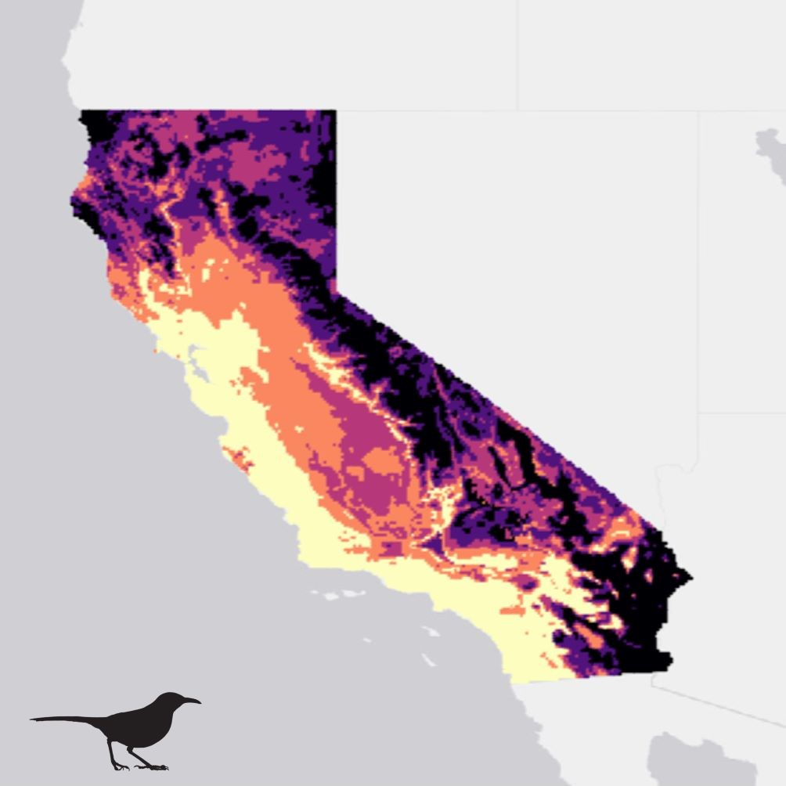
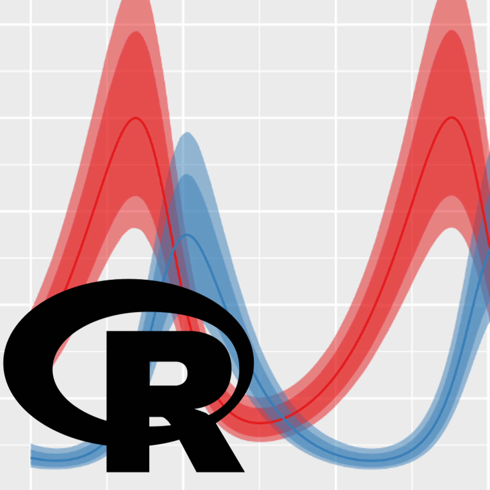
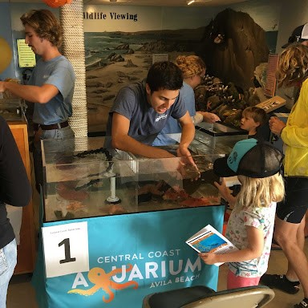

<html>
<head>

</head>
<body>

<h2>Quantitative Ecology</h2>

I feel strongly that the typical approach to teaching statistics to ecologists - as a collection of seemingly unrelated modeling techniques with strict assumptions - leaves students intimidated by the prospect of working with data. In fact, most of the statistical techniques that an ecologist needs in their toolbox can be understood as part of a cohesive and extensible framework. As an instructor for Stanford's Quantitative Ecology course, I've developed course materials and lesson plans to give students a crash course on the fundamentals - including probability, likelihood, and parameter estimation - and lead them in applying these methods to increasingly complex problems so that students are able to understand the reasoning underlying common methods such as GLMs and (hopefully) feel comfortable stepping out of pre-packaged methods when they need to. I take a mix of traditional and "flipped classroom" approaches, pre-recording lectures and using class time to work through labs together and discuss concepts. Course materials are developed in R, R markdown, and R Shiny, and are avaiable on my github.

  

<h2>Reproducible Scientific Computing</h2>

Ecologists are increasingly expected to know seemingly every skill under the sun - we have to be good field or lab researchers, writers, communicators, biostatisticians, and programmers. When it comes to programming, many of us learned slowly by coding for projects, and picked up some bad habits along the way. As a co-instructor for Stanford's "Just Enough Software Engineering for Science" mini-course (and in Quantitative ecology) I teach approachable tools and concepts which make producing well documented, robust, and reproducible code easier - R markdown for coupling thoughts and analysis choices with code, git & github for version control, and functional programming / Roxygen for breaking big tasks into small, well documented, and easily debuggable units. I find it doesn't take much to make the switch from ad-hoc scripting to proactive and defensive programming, and as ecology wrestles with it's own replication crisis, equipping ecologists with these approaches makes it easier for us to study nature in a rigorous and replicable fashion.

  

<h2>K-12 Science Education</h2>

Personally, I feel that the best way to motivate people to protect, conserve, and maybe even study the ocean is the make it tangible and accessible to them. In undergrad and after, I've logged over 800 volunteer hours working with nonprofit aquariums on the central coast doing outreach to communities, leading lesson plans for school groups, facilitating field trips on boats and in intertidal rocky habitats, and maintaining basic life support systems for marine animals. Many of the students I've worked with live on the California coast but have never been to the ocean or seen marine animals in person - these sorts of experiences can quite literally open a new world to students, some of whom may go on to become marine ecologists themselves. At Hopkins, I've also given approachable talks about my own research, and tours of our research facilities, to high school groups.

</body>
</html>